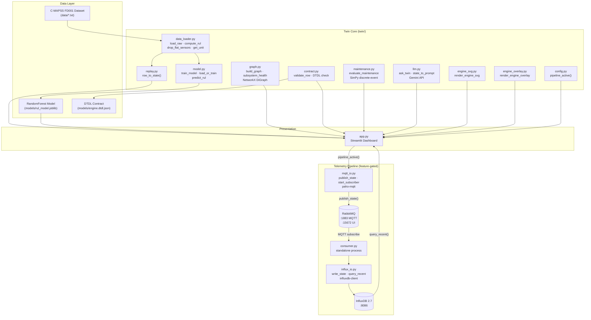
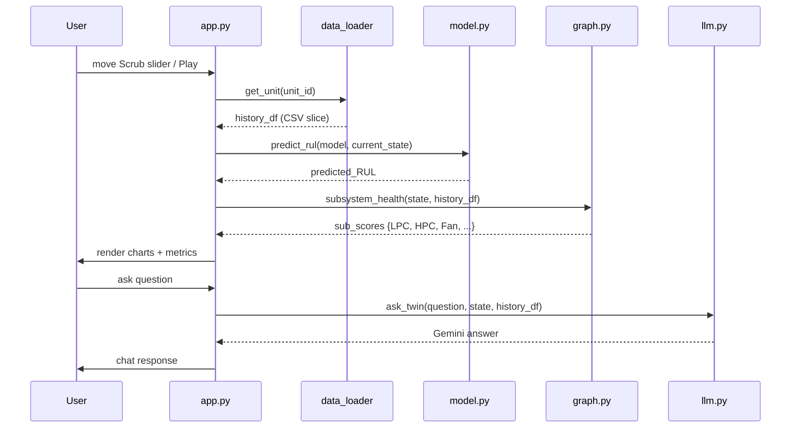
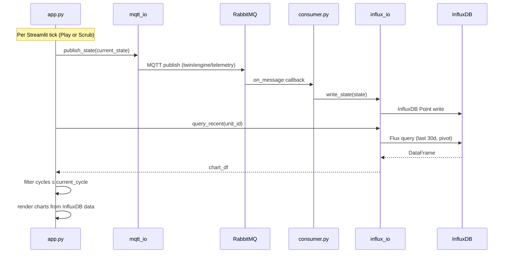
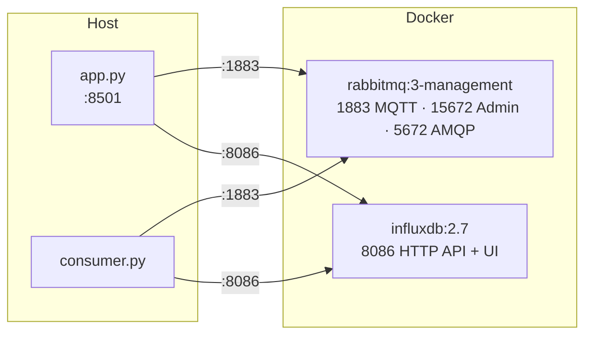

# Architecture — C-MAPSS Turbofan Engine Digital Twin

## System Overview

The system has two operating modes controlled by a single feature flag (`TWIN_ENABLE_PIPELINE`):

- **Flag OFF (default):** Fully self-contained Streamlit app. All data comes from in-memory replay of C-MAPSS CSV data.
- **Flag ON:** Streaming telemetry pipeline activates. App publishes each tick to RabbitMQ; a standalone consumer persists data to InfluxDB; dashboard reads back from InfluxDB.

---

## Component Map



---

## Data Flow

### Mode A — In-Memory Replay (pipeline OFF)



### Mode B — Streaming Pipeline (pipeline ON)



---

## Module Reference

### `twin/data_loader.py`
Loads and preprocesses the C-MAPSS dataset:
- `load_raw()` — reads whitespace-separated `.txt` file, assigns 26 column names.
- `compute_rul()` — calculates RUL as `max_cycle_per_unit - cycle`.
- `find_flat_sensors()` / `drop_flat_sensors()` — removes constant sensors (std ≤ 1e-6). Drops: sensor_1, 5, 10, 16, 18, 19.
- `get_unit(unit_id)` — full pipeline for a single engine unit.

### `twin/replay.py`
Converts a DataFrame row to the canonical `state` dict used across all modules:
```python
{
  "unit_id": int,
  "cycle": int,
  "RUL": int,
  "settings": {"op_setting_1": ..., "op_setting_2": ..., "op_setting_3": ...},
  "sensors": {"sensor_2": ..., "sensor_3": ..., ...}
}
```

### `twin/model.py`
RandomForest RUL predictor:
- Trains on C-MAPSS units 1–100 with RUL capped at 130.
- Uses `model.feature_names_in_` to enforce column order on inference (guards against InfluxDB column reordering).
- Auto-trains on first run; cached to `models/rul_model.joblib`.

### `twin/graph.py`
NetworkX directed graph: `Fleet → Engine_{id} → Subsystem → Sensor`.
`subsystem_health()` computes per-subsystem degradation score as mean % drift of member sensors over the last 20 cycles.

Subsystem mapping:
| Subsystem | Sensors |
|---|---|
| Fan | sensor_6, sensor_8, sensor_13, sensor_15 |
| HPC | sensor_3, sensor_7, sensor_9, sensor_11, sensor_14 |
| LPC | sensor_2 |
| LPT | sensor_4, sensor_21 |
| HPT | sensor_17, sensor_20 |
| Combustor | sensor_12 |

### `twin/contract.py`
Validates the current state dict against the DTDL schema (`models/engine.dtdl.json`). Checks all `Telemetry` and `Property` fields are present and finite. Maps raw `sensor_N` keys to DTDL names via `SENSOR_DTDL_MAP`.

### `twin/maintenance.py`
SimPy discrete-event simulation. When `predicted_rul < threshold`:
1. Generates a maintenance request.
2. Acquires a crew resource (capacity = 1).
3. Runs a 4-hour repair process.
4. Returns event log + urgency level (`High` / `Critical`).

### `twin/llm.py`
Builds a compact JSON prompt (current state + last 10 cycles history + subsystem scores) and sends to Gemini API (`gemini-3.1-flash-lite`). System prompt constrains the model to act as the digital twin.

### `twin/config.py`
Single source of truth for the pipeline feature flag. Checks `st.session_state.pipeline_enabled` first, falls back to `TWIN_ENABLE_PIPELINE` env var.

### `twin/mqtt_io.py`
- `publish_state()` — uses `paho.mqtt.publish.single()` (blocking — waits for message to fly before returning).
- `start_subscriber()` — blocking `loop_forever()` subscriber for the consumer process.

### `twin/influx_io.py`
- `write_state()` — writes one `engine_telemetry` Point per tick. Tags: `unit_id`. Fields: all sensors, settings, cycle, RUL.
- `query_recent()` — Flux query with pivot (field → column), sorted ascending by cycle.

### `twin/consumer.py`
Standalone process. Run separately from Streamlit. Subscribes to MQTT, calls `write_state()` on each message. Robust `try/except` per message.

---

## Infrastructure (docker-compose.yml)



RabbitMQ MQTT plugin enabled via `docker/rabbitmq_enabled_plugins`:
```
[rabbitmq_management,rabbitmq_mqtt].
```

---

## Feature Flag Design

The pipeline is **additive and fully isolated**. When `TWIN_ENABLE_PIPELINE=0` (default):
- No `import` of `mqtt_io` or `influx_io` executes at module level.
- `chart_df` stays as `history_df` (in-memory CSV slice).
- Zero UI difference.

When enabled, every new code path is inside `if pipeline_active():` blocks.
